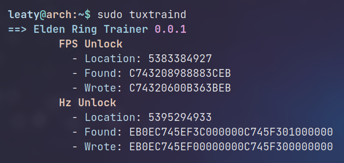

# TuxTrain
[](https://crates.io/crates/tuxtrain)
[](https://docs.rs/tuxtrain)

An easy-to-use generic trainer for Linux written in Rust, with basic memory hacking features. Use it for your games or applications where needed, there is also the `tuxtraind` daemon which will probe for processes and apply matching trainers automatically.



## Why?

Well at first I just wanted to run Elden Ring in fullscreen above 60hz, *and* without an FPS lock- I know, weird thing to say in 2022. But then I thought well why not make a generic trainer, can't be too difficult, so here it is.

## Trainers

Trainers in TuxTrain consist of very simple and easily expandable TOML files, see below example. Make sure you also read the [example trainer](https://github.com/leaty/tuxtrain/blob/master/trainers/example.toml) for a breakdown of each setting.

```toml
name = "My Trainer"
version = '0.0.1'
process = "someprocess"
enable = true

[daemon]
delay = 2000 

[[feature]]
name = "FPS Unlock"
region = [7123045, 9124418]
pattern = "FF __ CB 00 7F __ __ D0"
replace = "__ __ 9F 5C __ 58 88 __"
enable = true 

[[feature]]
name = "Infinite Ammo"
region = [52030, 73204]
pattern = "FF 00 __ 00 __ __ 7F 58 D0"
replace = "__ __ __ __ 0B 4C __ __ __"
enable = true
```

## Installation

### Arch Linux
The official AUR can be found here: https://aur.archlinux.org/packages/tuxtrain

*Or* use an AUR helper like [paru](https://github.com/Morganamilo/paru) or [yay](https://github.com/Jguer/yay).
```bash
paru -S tuxtrain
```

### Manually
Clone and run:
```
cargo install --path .
```

This will by default install `tuxtrain` and `tuxtraind` to `~/.cargo/bin`. You can add this to your PATH if you wish.

Next, create the directory `/etc/tuxtrain` and copy the trainers you want there. Otherwise you can only use the `tuxtrain -t path/to/trainer.toml` method.

## Running TuxTrain
Since accessing and writing memory in foreign processes require certain permissions, TuxTrain must almost always run as root, unless you manually take ownership of the process.

This will run all trainers from `/etc/tuxtrain/*` *once*. Naturally, nothing will happen if the programs the trainers look for aren't running. Also, you can run a single trainer from `/etc/tuxtrain/*` or even specify a file, see `--help` for other options.
```
sudo tuxtrain
```

## Running TuxTrain daemon
This will probe all trainers from `/etc/tuxtrain/*` every second, which is also the default rate. Once a program is discovered, the trainers matching it will execute. The same trainer will *not* run again while the program is still running, but once it is stopped and started again the same trainer will trigger.
```
sudo tuxtraind --rate 1000
```

## Running as a service
This is probably what most people want, starting it automatically at boot and whenever you launch your favorite game or program, the matching trainer(s) are automatically applied. Even if you don't want something like "Infinite Ammo" all the time, you should instead disable this in the trainer, because having an FPS unlocker apply automatically is quite nice. 

There is an example service [here](https://github.com/leaty/tuxtrain/blob/master/tuxtraind.service).

## Contribute

### Trainers
I urge anyone with useful hacks or features to contribute with trainers in order to have a good set of official [trainers](https://github.com/leaty/tuxtrain/tree/master/trainers) in this repository making sharing and redistribution a cakewalk. It could be almost anything; application automation, FPS unlockers, mouse acceleration patches, or even infinite ammo or infinite health etc. However, make no mistake- I completely abhor cheating, but as long as it's for singleplayer experiences it's perfectly OK.

### Code
There may be important features missing for certain trainer operations, I am in no way an expert on trainers so if there's something important in which the current search/replace functionality cannot cover, please reach out!

## DISCLAIMER
Memory hacking is fragile, I bear no responsibility if something either doesn't work or if something breaks. Thankfully memory is also temporary, so in most cases a simple restart of the program or a reboot will fix it.

### Anti-Cheat
TuxTrain is always going to be intended for offline use, so this is never about cheating. But, if you intend to use the Elden Ring trainer, **I ADVICE YOU TO NOT RUN THIS WITH EAC ENABLED**. The same goes for any future trainer in this repository, whether it be EAC or BattleEye or something else.

I bear no responsibility whatsoever for any potential bans, remember this is memory hacking after all and it could be seen as nefarious even when it's not. In fact in this particular case, it kind of *is* nefarious (thanks to FromSoftware) since other players in Elden Ring are limited to 60 FPS.

TuxTrain is generic and it doesn't care what you are doing, therefor it does **NOT** care about something like EAC. I've not yet heard anyone neither try nor getting banned for unlocking their FPS, but I don't think you'd want to be the first either.
